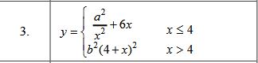
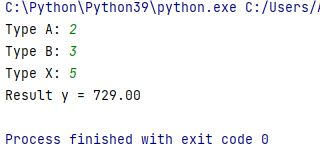
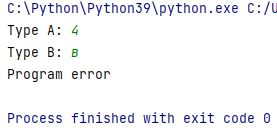
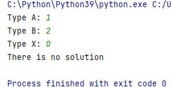

## Nurkaydarov lab work #1 Python

---
__Задание:__ _Создать консольную программу_
___

___
__Вариант №3__:

---

___
__Результат__

__Результат при неверных входных данных__

__Результат при делений не ноль__

___